# 超市管理系统

### 9.9￥ 获取完整源码+sql，需要加Q：3577148218 ,备用Q: 3808981644
### 有问题，或者需要协助调试运行项目的也可联系
### 更多项目： https://github.com/34426?tab=repositories

## 一、介绍

超市购物管理系统 jsp+java+springmvc+mysql 

管理员功能模块

一、进货管理
1、进货信息
2、退货信息

二、商品信息管
1、商品信息
2、商品类别

三、库存管理
1、库存信息
2、库存预警
3、临期产品

四、销售管理
1、销售信息
2、销售统计
3、顾客退货办理

五、客户信息管理
1、客户信息

六、员工信息管理
1、员工信息
七、供应商信息管理
1、供应商信息

用户功能模块

一、进货管理
1、进货信息
2、退货信息

二、商品信息管
1、商品信息
2、商品类别

三、库存管理
1、库存信息
2、库存预警
3、临期产品

四、销售管理
1、销售信息
2、销售统计
3、顾客退货办理

五、客户信息管理
1、客户信息

六、供应商信息管理
1、供应商信息

## 二、系统运行界面

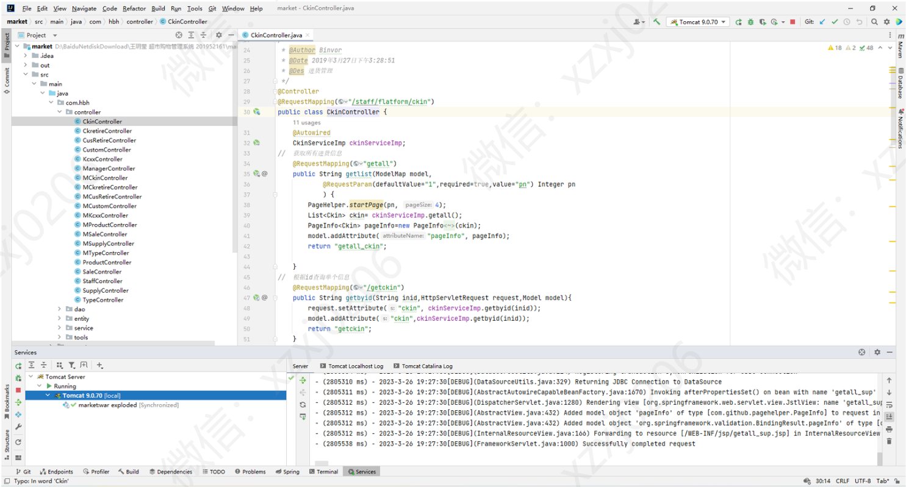

## 三、系统运行界面

### 1、管理员模块部分功能页面展示

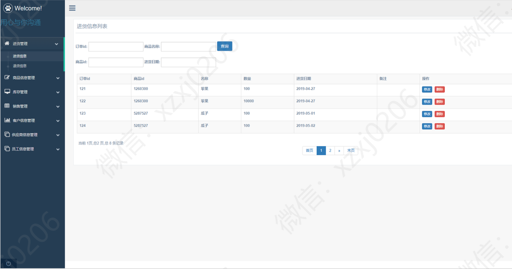

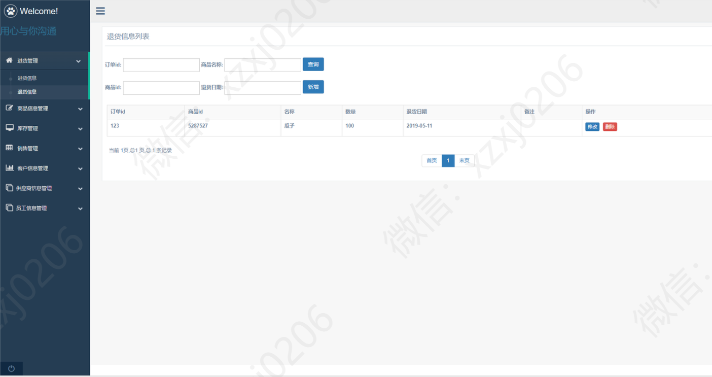

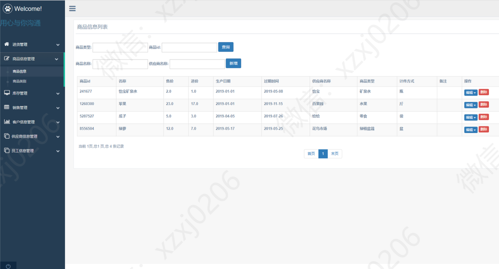

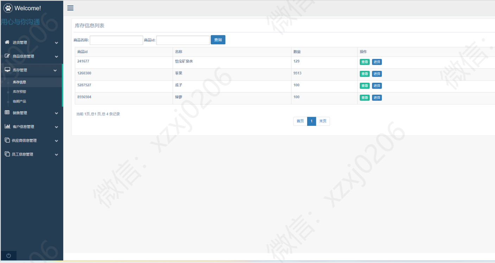

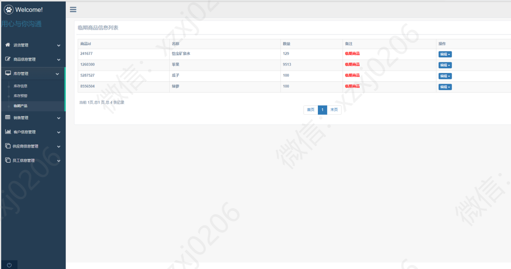

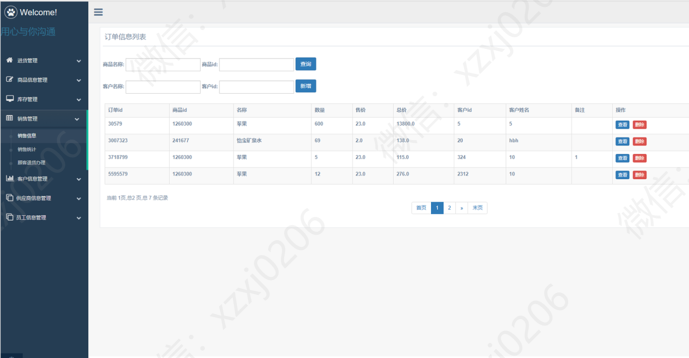

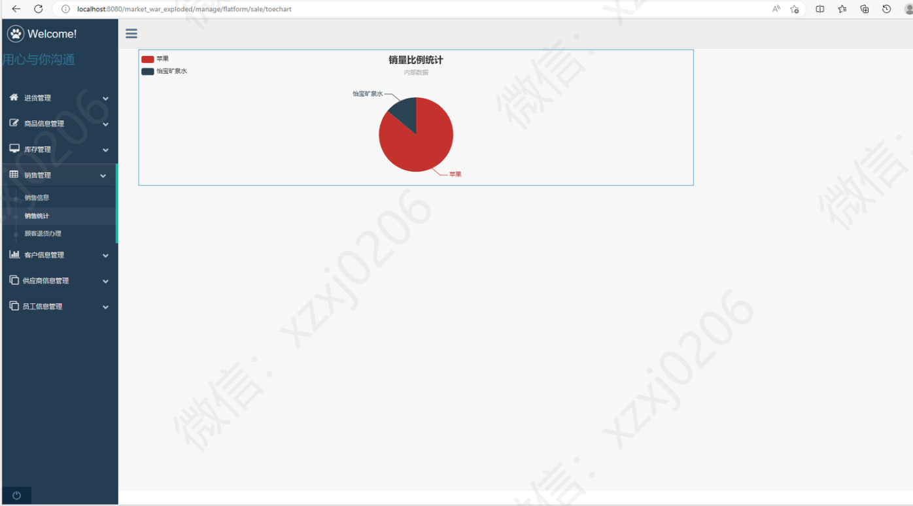

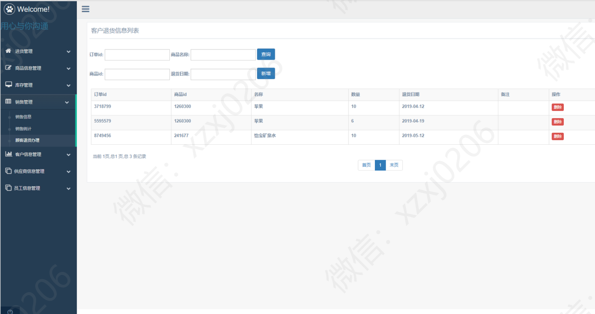

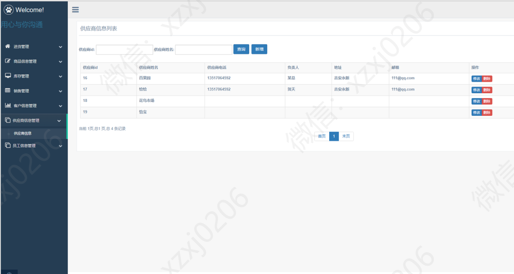

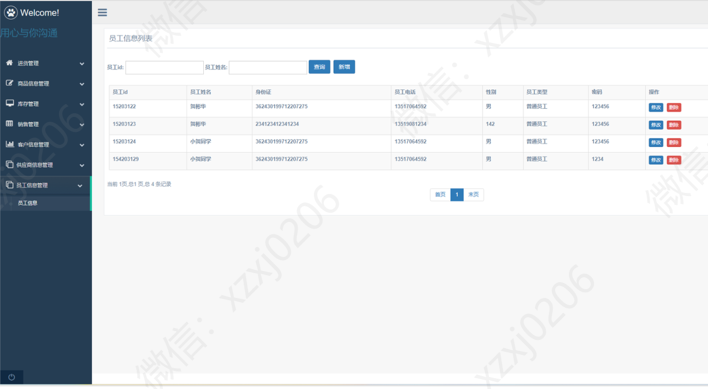

### 2、员工模块部分功能页面展示

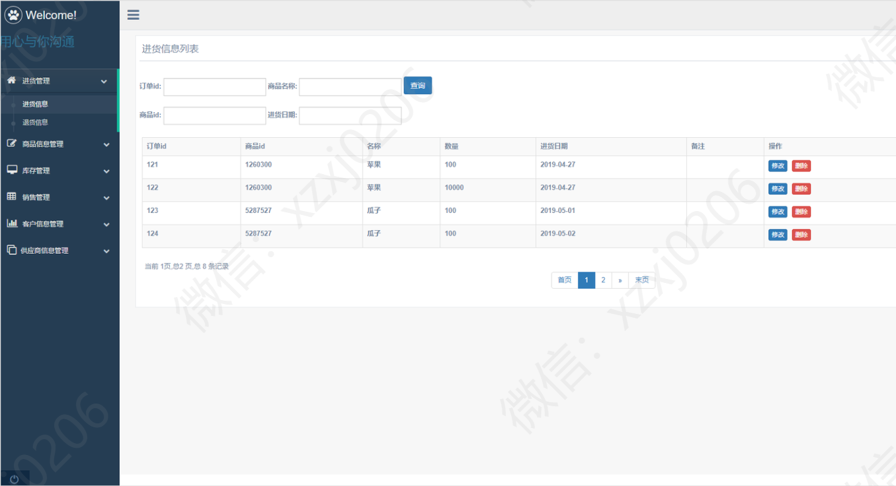

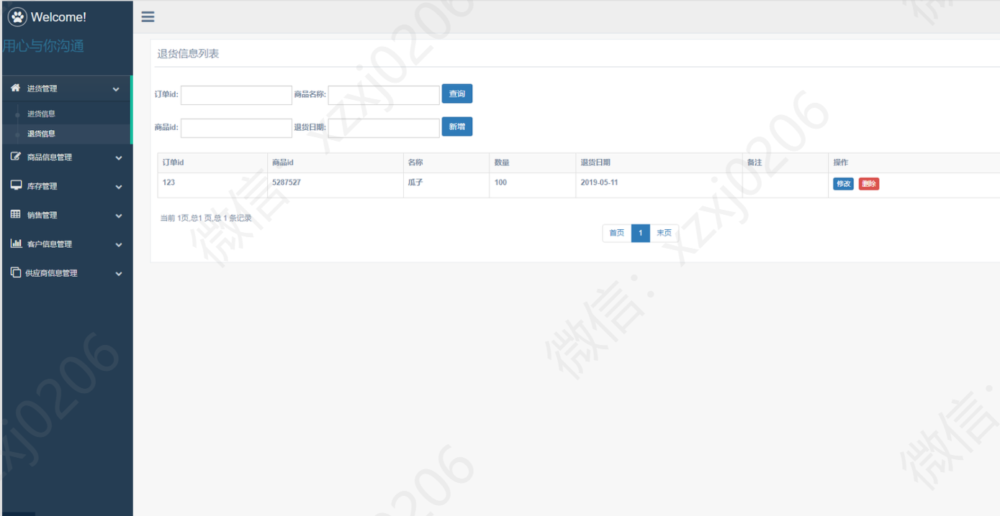

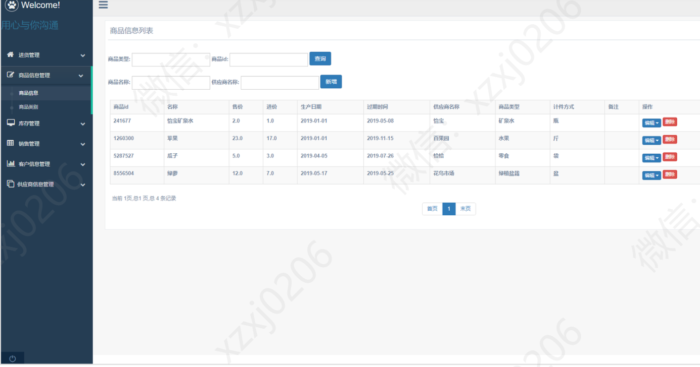

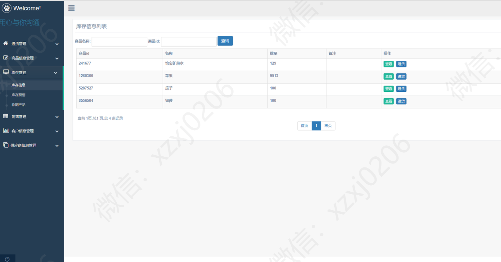

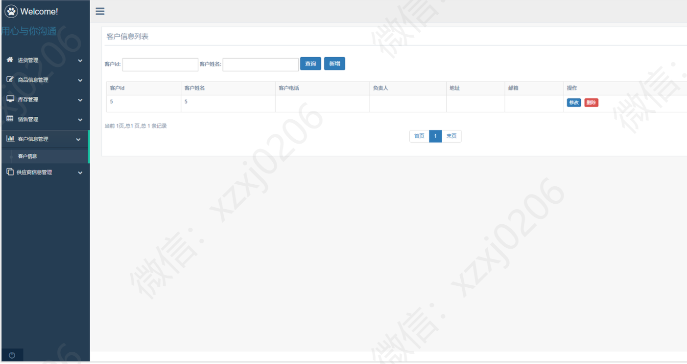

### 9.9￥ 获取完整源码+sql，需要加Q：3577148218 ,备用Q: 3808981644
### 有问题，或者需要协助调试运行项目的也可联系

