# 超市管理系统带七千字项目文档

### 完整项目获取

通过网盘分享的文件：超市进销存管理系统

链接: https://pan.baidu.com/s/11869DeCKvYaQNURuAziDEA?pwd=aaxr 提取码: aaxr
--来自百度网盘超级会员v3的分享

### 项目合集(项目不断更新中，包含java、vue、python、Android、微信小程序等项目)

链接: https://pan.baidu.com/s/1nY-zhvAK0CXYcn3g7LzQnQ?pwd=id3c 提取码: id3c
--来自百度网盘超级会员v3的分享

### 工具包

链接: https://pan.baidu.com/s/1YmdoJvkjoUjA75wvHLDZ6A?pwd=xm96 提取码: xm96
--来自百度网盘超级会员v3的分享

需要远程项目部署或项目修改和毕业设计也可联系（添加申请时请备注好来意）

### 远程调试部署联系方式

链接: https://pan.baidu.com/s/1W0dDcoZmayG0c7USJDYBYg?pwd=nqd7 提取码: nqd7
--来自百度网盘超级会员v3的分享

#### 这些项目一起发你了 可以分享给你需要的同学 调试可找我 也接二次修改和项目定制、毕业设计等

## 接毕业设计和论文

微信联系方式：xzxj0206  QQ：3808981644   (支持修改、 部署调试、 支持代做毕设)

接网站建设、小程序、H5、APP、各种系统等，单片机、嵌入式也可以做

选题+开题报告+任务书+程序定制+安装调试+论文+答辩ppt  都可以做

## 一、介绍

超市购物管理系统 jsp+java+springmvc+mysql 

管理员功能模块

一、进货管理
1、进货信息
2、退货信息

二、商品信息管
1、商品信息
2、商品类别

三、库存管理
1、库存信息
2、库存预警
3、临期产品

四、销售管理
1、销售信息
2、销售统计
3、顾客退货办理

五、客户信息管理
1、客户信息

六、员工信息管理
1、员工信息
七、供应商信息管理
1、供应商信息

用户功能模块

一、进货管理
1、进货信息
2、退货信息

二、商品信息管
1、商品信息
2、商品类别

三、库存管理
1、库存信息
2、库存预警
3、临期产品

四、销售管理
1、销售信息
2、销售统计
3、顾客退货办理

五、客户信息管理
1、客户信息

六、供应商信息管理
1、供应商信息

## 二、七千字项目文档

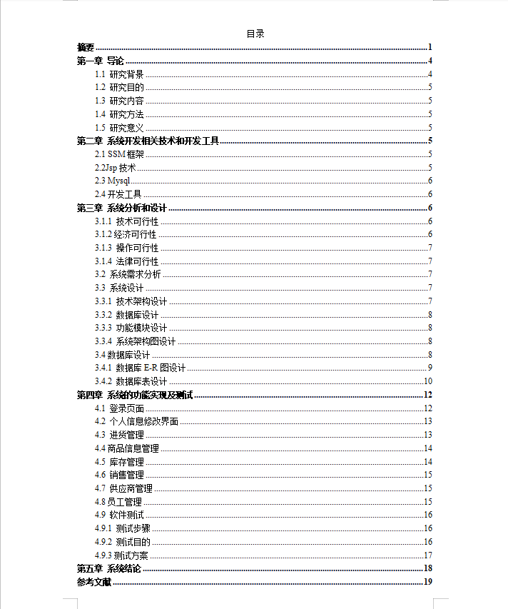

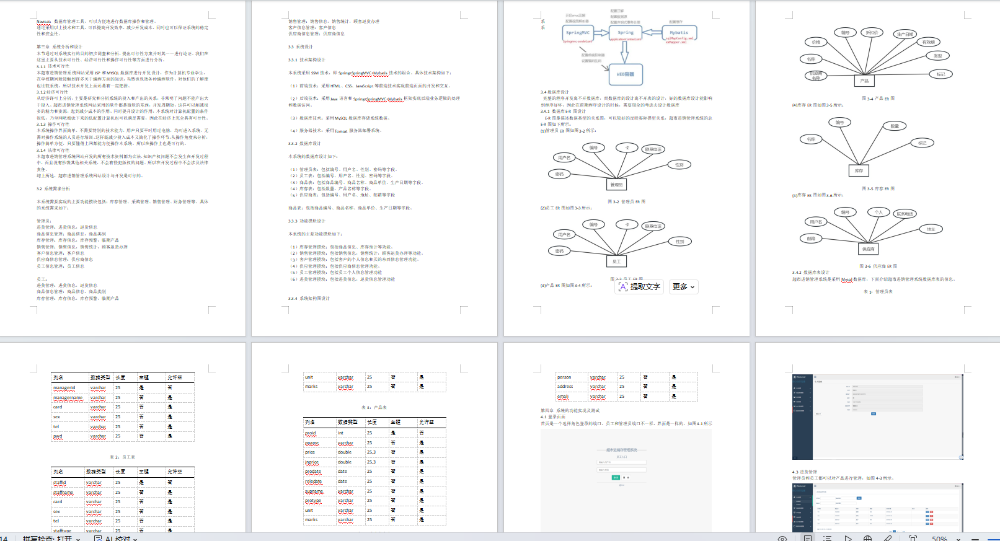

## 三、系统运行界面

### 1、管理员模块部分功能页面展示

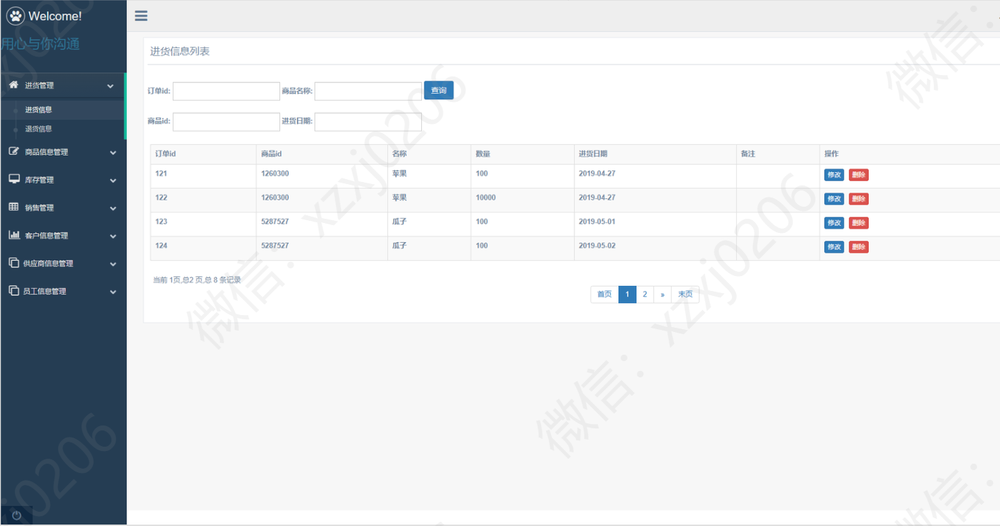

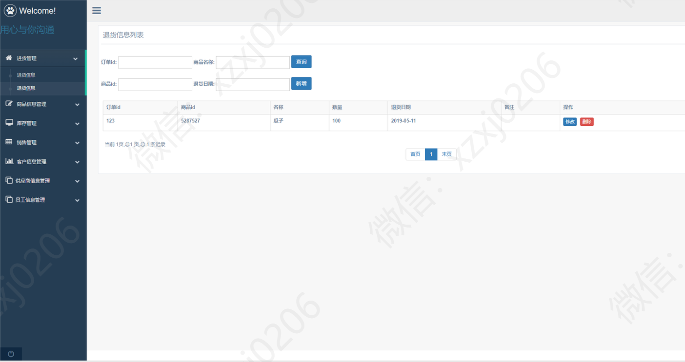

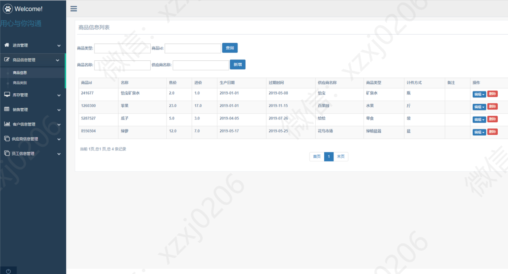

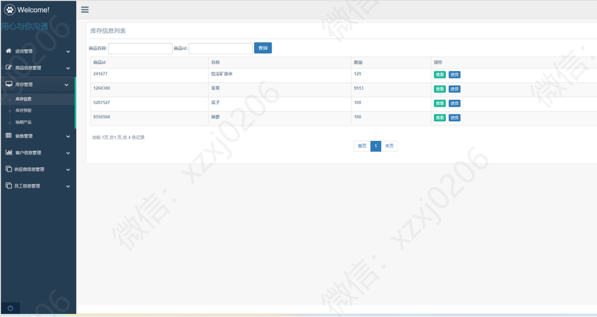

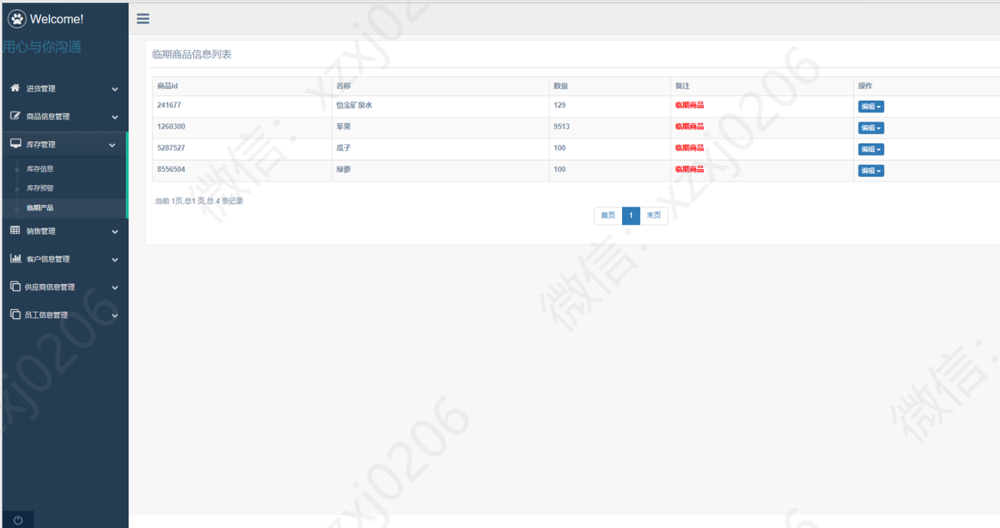

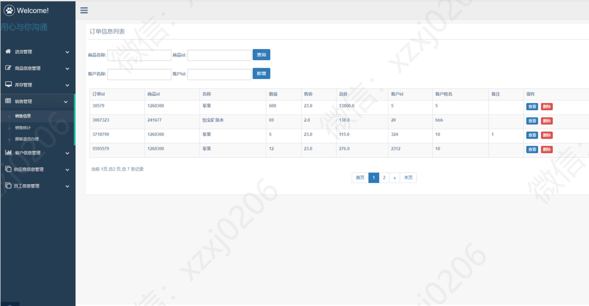

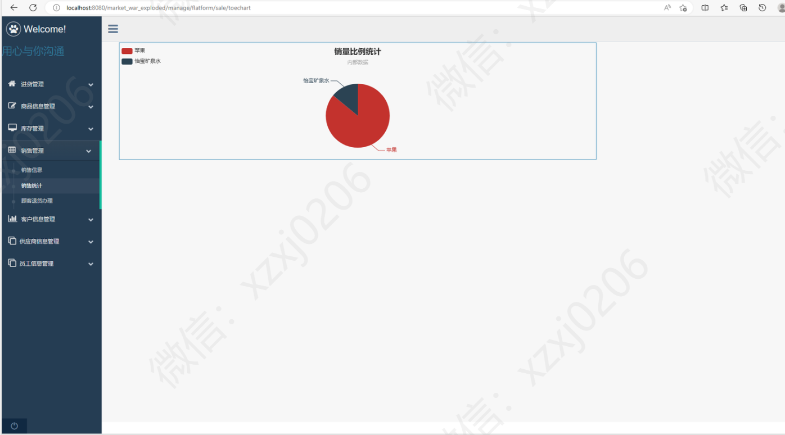

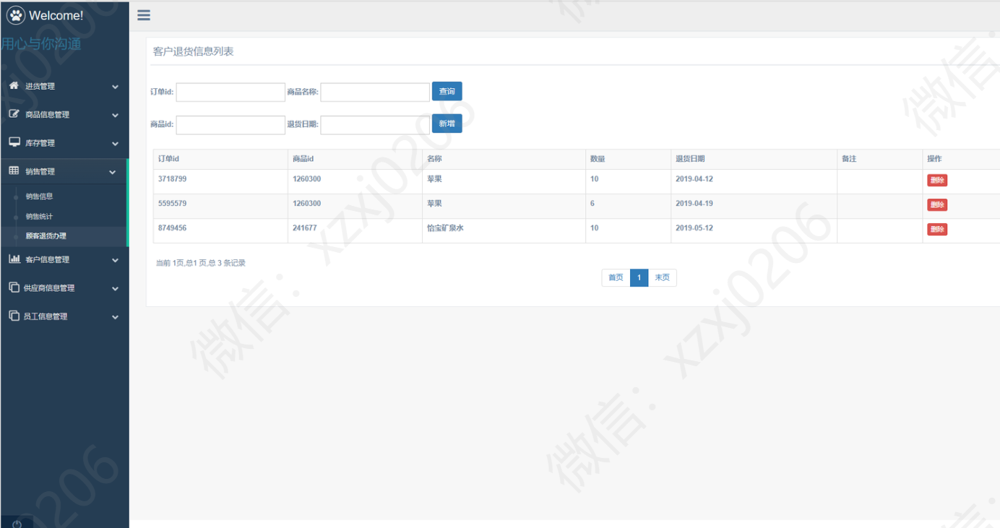

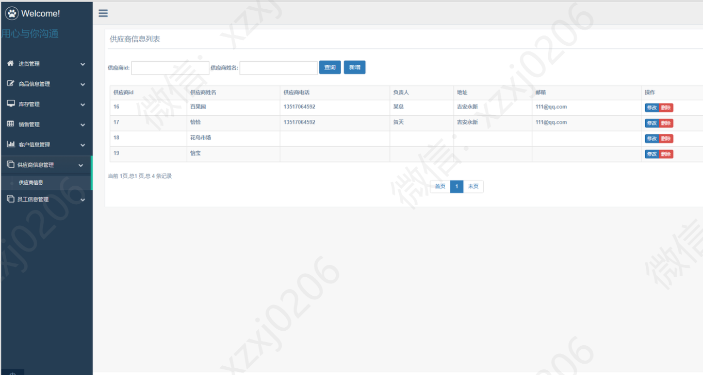

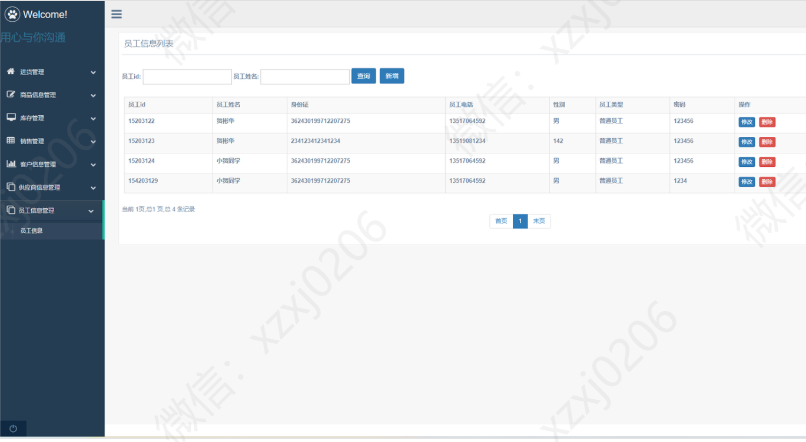

### 2、员工模块部分功能页面展示

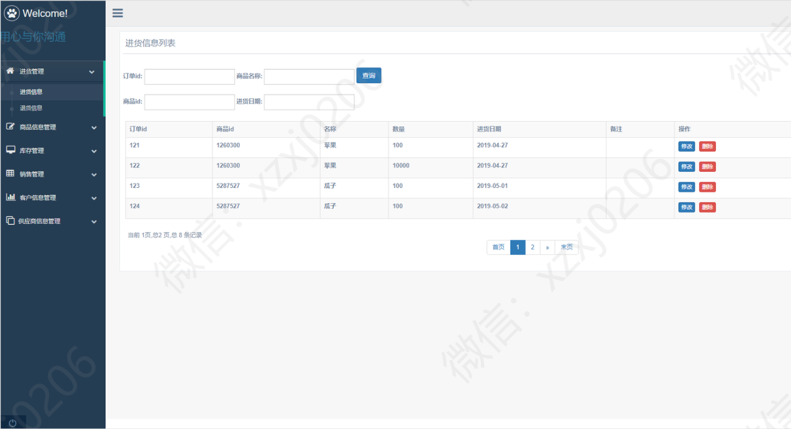

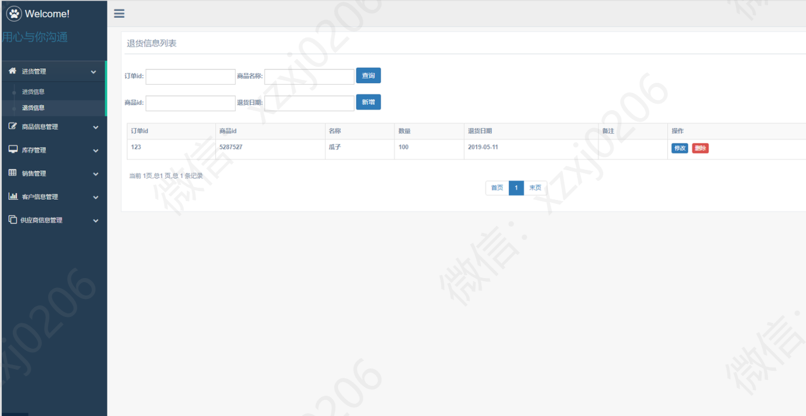

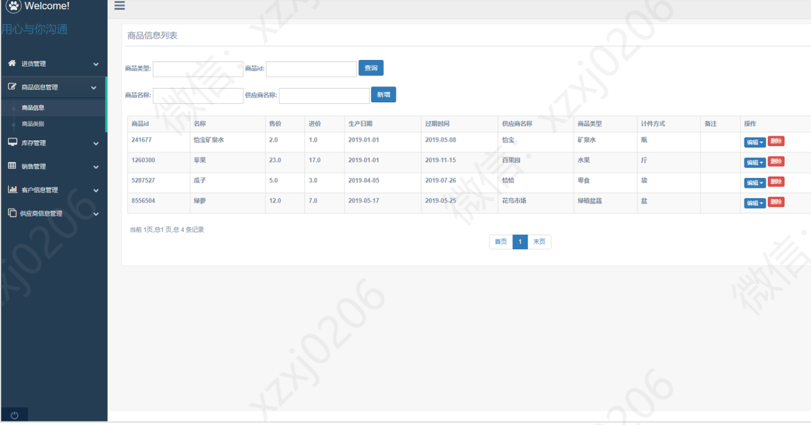

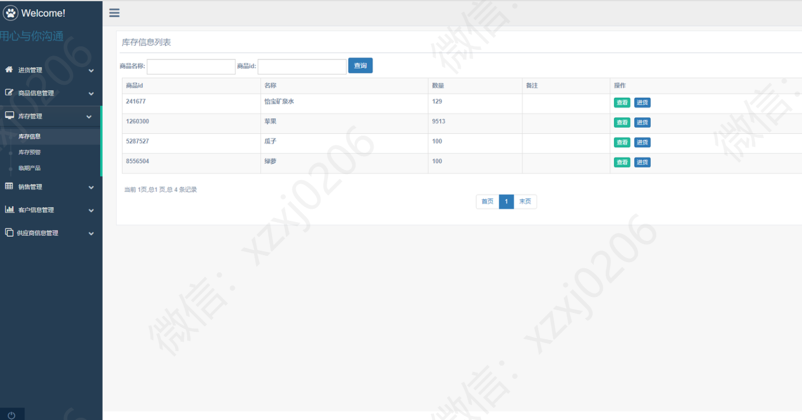

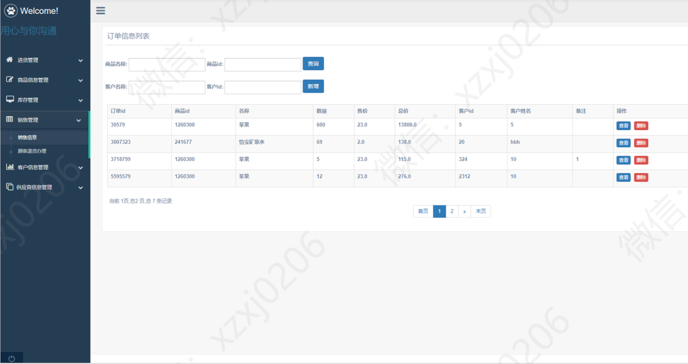

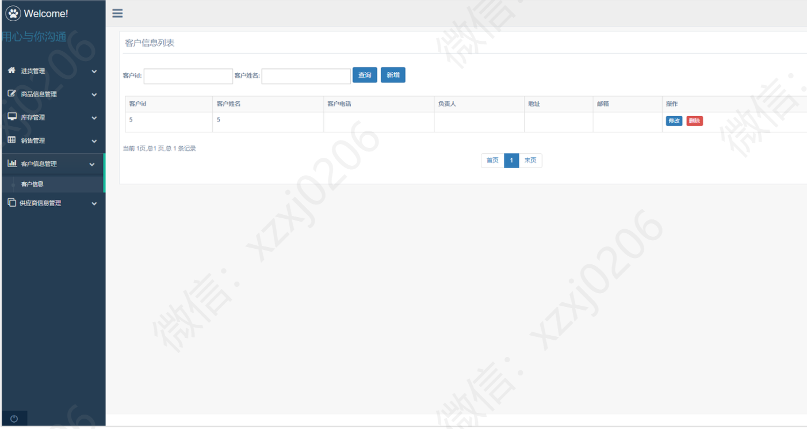

